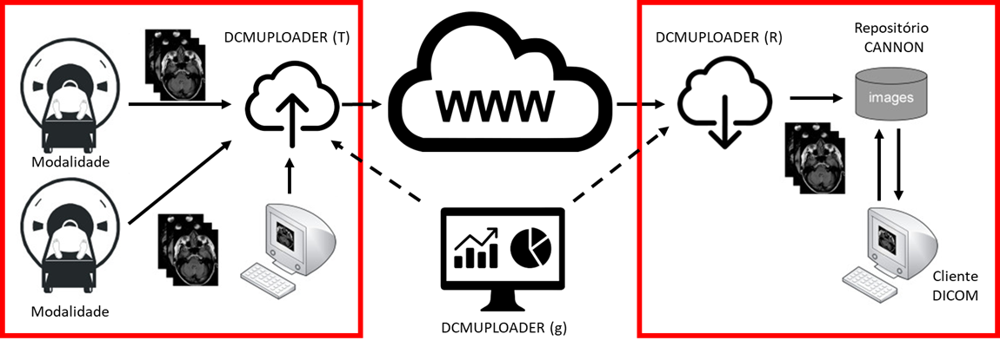
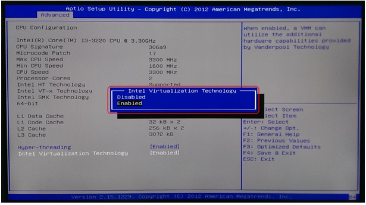
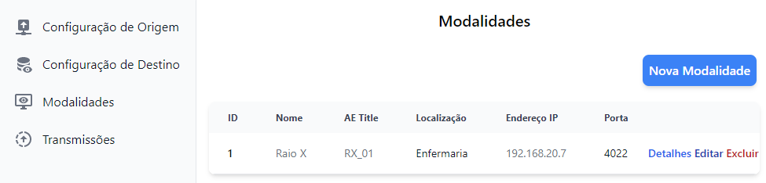
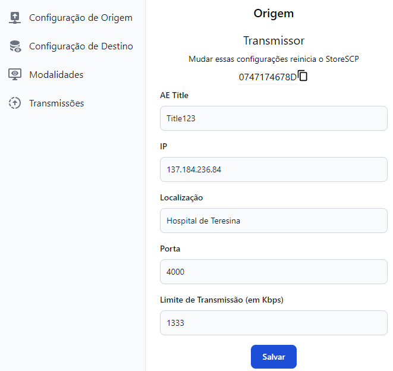
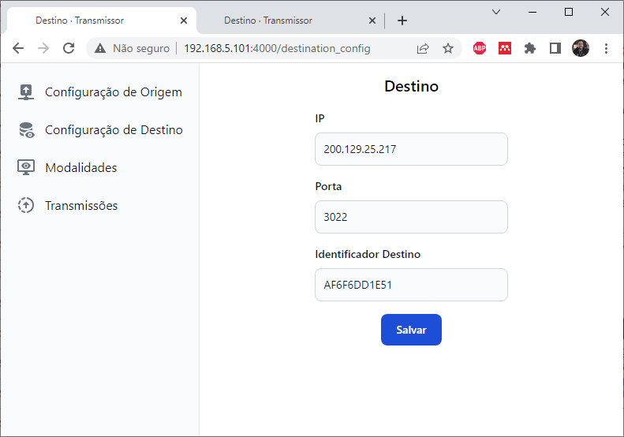
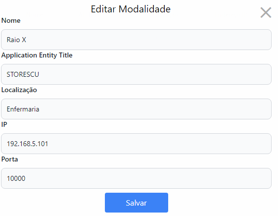
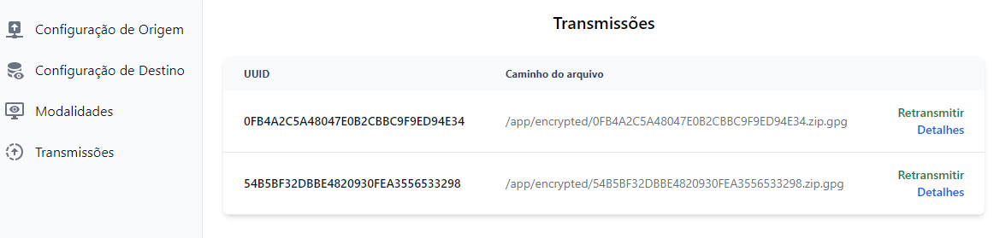
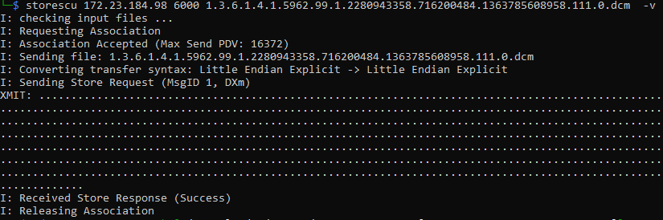

**MANUAL DE UTILIZAÇÃO DO DCMUPLOADER T**

+--------------------------------------------------------+-------------+
| Projeto DCMUPLOADER                                    | {width= |
|                                                        | "1.08759842 |
|                                                        | 51968505in" |
|                                                        | height=     |
|                                                        | "0.98425196 |
|                                                        | 8503937in"} |
+========================================================+=============+
+--------------------------------------------------------+-------------+

  -----------------------------------------------------------------------
  **Responsável:** Prof.     
  D.Sc. Rodrigo Carvalho     
  Souza Costa                
  -------------------------- --------------------------------------------
  **Elaboradores:**          

  Felipe Leo Cavalcante dos  felipe.leo@lapada.ifce.edu.br
  Santos                     

  Vinicius Menezes           vinicius.menezes@lapada.ifce.edu.br
  -----------------------------------------------------------------------

Fortaleza - CE

Maio de 2022

**Histórico de Revisões**

  ------------------------------------------------------------------------
  Versão    Data             Descrição              Autor
  --------- ---------------- ---------------------- ----------------------
  A.01      23/05/2022       Início da elaboração   Rodrigo Costa
                             do documento           

  A.02      02/08/2022       Revisão das correções  Rodrigo Costa

                                                    
  ------------------------------------------------------------------------

**Visão geral do documento**

**Status**: Completo

**Público alvo**: pesquisadores do time DCMUPLOADER/LAPADA e time Canon
Medical

**Sumário**

**[1. Visão Geral do Produto](#visão-geral-do-produto) 1**

**[2. Pré-requisitos para implantação do DCMUPLOADER
(T)](#pré-requisitos-para-implantação-do-dcmuploader-t) 1**

**[3. Configuração do Docker](#configuração-do-docker) 2**

**[4. Instalação do DCMUPLOADER (T)](#instalação-do-dcmuploader-t) 3**

**[5. Interface de configuração do DCMUPLOADER
(T)](#interface-de-configuração-do-dcmuploader-t) 3**

> **[5.1 Configuração das Informações do DCMUPLOADER
> (T)](#configuração-das-informações-do-dcmuploader-t) 4**
>
> **[5.2 Configurações do DCMUPLOADER R de
> destino](#configurações-do-dcmuploader-r-de-destino) 4**
>
> **[5.3 Cadastramento de modalidades autorizadas para utilizar o
> DCMUPLOADER](#cadastramento-de-modalidades-autorizadas-para-utilizar-o-dcmuploader)
> 5**

**[6. Monitoramento das transmissões](#monitoramento-das-transmissões)
6**

**[7. Envio de Estudos](#envio-de-estudos) 7**

**[8. Conclusões](#conclusões) 8**

# 

# **1. Visão Geral do Produto**

O DCMUPLOADER TRANSMISSOR (T) é um subsistema da solução DCMUPLOADER,
mostrado na Figura 1, sendo o responsável por transferir de forma segura
e transparente para transmitir os estudos médicos entre diferentes redes
conectadas através da Internet.

Figura 1: visão geral do sistema DCMUPLOADER.

{width="6.267716535433071in"
height="2.1805555555555554in"}

O DCMUPLOADER (T) se integra facilmente à infraestrutura pré-existente
dos hospitais e se comporta como um SCP DICOM, recebendo estudos através
do comando C-STORE previsto no padrão DICOM. Após receber os estudos,
este uploader realiza os procedimentos transmissor irá criptografar e
comprimir os estudos e então transferi-los ao DCMUPLOADER Receptor (R)
localizado na rede de uma localidade remota.

O DCMUPLOADER Transmissor é composto por:

-   Servidor DICOM para recebimento de estudos a partir de modalidades
    > ou PACs;

-   Interface web de configuração das modalidades autorizadas a utilizar
    > o DCMUPLOADER (T) e configuração do DCMUPLOADER Receptor (R);

-   Solução para comunicação entre uploaders para envio de estudos e
    > gerenciamento.

Ao executar o DCMUPLOADER (T) o usuário pode acessar o sistema de
configuração no IP da estação que está hospedando o uploader na porta
4000 e o sistema abre a porta 6000 para recebimento dos estudos.

# **2. Pré-requisitos para implantação do DCMUPLOADER (T)**

A implantação do DCMUPLOADER (T) exige um sistema computacional com as
seguintes características:

-   Computador com Linux com pelo menos 1 GB de RAM e processador com
    > suporte ao recurso de Virtualização com tradução de Segundo Nível
    > (Second Level Address Translation - SLAT);

-   Recurso de Virtualização habilitado na BIOS do computador;

-   Máquina com acesso a internet para obtenção das ferramentas
    > necessárias;

-   Sistema para virtualização de container Docker instalado no sistema
    > operacional;

-   Biblioteca docker-compose instalada no sistema operacional.

Configuração recomendada para instalação do DCMUPLOADER (T) :

-   Máquina virtual 64 bits com 1 CPU virtual com 2 GB de RAM

-   Sistema operacional Ubuntu Server 20.04 LTS

-   Conexão ethernet da máquina virtual com a Internet.

# **3. Configuração do Docker**

Para realizar a instalação do DCMUPLOADER, o usuário deve garantir que o
recurso de virtualização do processador está habilitado na BIOS do
computador. O usuário deve abrir a interface de configuração da BIOS e
habilitar o recurso conforme mostrado na Figura 2.

Figura 2: exemplo de menu de configuração do recurso de virtualização na
BIOS.

{width="4.765625546806649in"
height="2.6677996500437446in"}

Uma vez habilitado este recurso e instalado o sistema operacional do
computador, o usuário precisa realizar a sequência de comandos mostradas
a seguir para realizar a instalação do Docker no sistema operacional
UBUNTU 20.04 ou superior.

Para realização da instalação do docker no UBUNTU, o usuário deve
inicialmente se logar diretamente no usuário root. ou se logar em um
usuário com privilégios de administrador (root). Para transformar o
usuários com privilégios de administrador em root, o usuário deve abrir
uma janela do terminal de sua preferência e realizar o seguinte comando:

**sudo su**

Uma vez como root, o usuário deve inicialmente atualizar a lista de
pacotes do sistema operacional através do comando:

**apt-get update**

Depois disto, o usuário deve inserir o seguinte comando para instalar o
Docker e o Docker-compose no ubuntu

**apt-get install docker.io docker-compose**

# **4. Instalação do DCMUPLOADER (T)**

Nesta versão do manual, a instalação é realizada através do
compartilhamento do acesso ao repositório do código fonte do
DCMUPLOADER. Desta forma, para a realização da instalação faz-se
necessário o uso de uma credencial de acesso de usuário no gitlab com
permissão de visitante ao repositório:

**https://github.com/toshibamedical/uploader.git**

Uma vez com as credenciais do repositório o usuário deve realizar o
seguinte comando para obter o código fonte:

**git clone https://github.com/toshibamedical/uploader.git**

após obter os arquivos do repositório, o usuário deve acessar o
diretório do DCMUPLOADER (T) através do comando

**cd software/uploader_t**

**chmod u+x app/entrypoint.sh**

iniciar o container do DCMUPLOADER (T) com privilégios de administrador
utilizando o comando

**sudo docker-compose up ---build -d**

Este comando realiza a instalação do container do DCMUPLOADER (T) e após
a realização da compilação da imagem, o container inicia sua execução e
depois de alguns minutos o usuário pode acessar a interface de
configuração do DCMUPLOADER (T) através do endereço http://\<ip da
máquina\>:4000 .

# **5. Interface de configuração do DCMUPLOADER (T)**

Após cerca de 5 minutos após a realização do comando para inicializar o
docker do DCMUPLOADER, o usuário pode acessar a interface web de
configuração do DCMUPLOADER (T).

Ao acessar o endereço da interface de configuração do DCMUPLOADER (T) na
porta 4000. Por exemplo, caso o IP da máquina onde o docker está
instalado seja o IP 192.168.0.10, o administrador deverá acessar no seu
navegador o endereço

**http://192.168.0.10:4000**

Ao acessar a interface de configuração, o usuário poderá configurar o
servidor SCP do DCMUPLOADER e indicar o DCMUPLOADER (R), conforme
mostrado na Figura 4.

Figura 4: interface web de configuração do UPLOADER transmissor.

{width="6.385506342957131in"
height="1.5250820209973752in"}

## 5.1 Configuração das Informações do DCMUPLOADER (T)

Ao clicar na barra lateral a opção **[Configuração de
Origem]{.underline}**, abre-se a interface de configuração do
DCMUPLOADER (T), conforme mostrado mostrado na Figura 5

Figura 5: interface web de configuração do SCP do UPLOADER T.

{width="5.6786482939632545in"
height="5.337489063867016in"}

Nesta interface, o usuário realiza a configuração das informações de
localização do UPLOADER (T) configurado. Conforme , o usuário pode
definir o AE Title do SCP que ficará visível na rede de origem, a
informação do nome de exibição do UPLOADER e a taxa de transmissão
máxima que o DCMUPLOADER T poderá utilizar.

Uma vez configurado , o DCMUPLOADER (T) fica no aguardo de pedidos de
conexão para receber estudos das modalidades autorizadas na interface de
configuração e encaminhará automaticamente para DCMUPLOADER (R)
cadastrado.

## 5.2 Configurações do DCMUPLOADER R de destino 

Ao clicar na opção **[Configuração de Origem]{.underline}** presente na
barra lateral, o usuário irá acessar a tela de configuração do uploader
R de destino que irá receber os estudos para armazenamento no PACs
remoto, mostrada na Figura 6.

Figura 6: interface web de configuração do UPLOADER transmissor.

{width="5.260416666666667in"
height="2.8959416010498686in"}

Ao abrir esta interface, o usuário deve informar selecionar o
Identificador do DCMUPLOADER (R) que irá receber os estudos que forem
enviados a este DCMUPLOADER (T) e informar o endereço IP público do
DCMUPLOADER ® de destino e a porta de recebimento liberada para o
recebimento de estudos criptografados.

Sempre que for realizadas alterações na interface, o DCMUPLOADER (T)
envia uma solicitação ao DCMUPLOADER (G) para que este encaminhe as
credenciais de acesso ao DCMUPLOADER (R) selecionado, previamente
autorizado no DCMUPLOADER (G).

## 5.3 Cadastramento de modalidades autorizadas para utilizar o DCMUPLOADER

Ao clicar na opção **[Modalidades]{.underline}** presente na barra
lateral, o usuário tem acesso a interface de configuração das
modalidades autorizadas para o envio de dados ao UPLOADER T. Desta
forma, o usuário deve acessar a interface mostrada na Figura 7 e clicar
no botão {width="1.000832239720035in"
height="0.3040507436570429in"} e inserir as informações da modalidade
(Nome, AETITLE, Localização, IP e porta) conforme apresentado na Figura
8.

Figura 7: interface web de configuração das modalidades no UPLOADER
transmissor.

{width="6.688940288713911in"
height="1.5975524934383203in"}

Figura 8: dados necessários para cadastramento de modalidade autorizada.

{width="4.443966535433071in"
height="3.450071084864392in"}

Após a realização destas configurações, o DCMUPLOADER (T) está pronto,
restando apenas a autorização do gerente no DCMUPLOADER (G) para que o
DCMUPLOADER (T) possa iniciar o envio de estudos para a localidade
remota.

# **6. Monitoramento das transmissões**

O DCMUPLOADER (T) possui uma interface para monitoramento e
gerenciamento das transmissões efetuadas pelo DCMUPLOADER. Ao clicar no
na opção **[Transmissões]{.underline}** presente na barra lateral da
interface de configuração WEB.

Esta interface apresenta a lista das transmissões efetuadas por este
upload que ocorreram erros de transmissão , indicando informações sobre
o estudo e o status dessa transmissão, conforme mostrado na Figura 9.

Figura 9: Tela de retransmissão de estudos onde ocorreu falha de
transmissão.

{width="6.267716535433071in" height="1.5in"}

Caso o usuário deseje realizar a retransmissão dos estudos, o mesmo
deverá clicar no botão retransmitir presente na interface.

# **7. Envio de Estudos**

Para realização do envio de estudos através do DCMUPLOADER (T), o
administrador deve realizar os seguintes procedimentos:

1.  Realizar a instalação dos pré-requisitos para execução do sistema
    > conforme descrito na seção 3 deste manual.

2.  Realizar a Instalação do DCMUPLOADER (T) conforme descrito na seção
    > 4 deste manual.

3.  Realizar a configuração das informações do DCMUPLOADER(T) conforme
    > descrito na seção 5.1

4.  Cadastrar as modalidades que são autorizadas para utilizar o
    > DCMUPLOADER(T) para transmissão de dados remotos conforme descrito
    > na seção 5.3

5.  Entrar em contato com o Gerenciador do DCMUPLOADER para autorizar o
    > DCMUPLOADER(T) configurado para ingressar na rede de DCMUPLOADERs.

6.  Entrar em contato com o administrador do DCMUPLOADER (R) para obter
    > o identificador do DCMUPLOADER de destino e informações do IP
    > público e porta disponibilizada para recebimentos de estudo na
    > Localidade de Destino.

7.  Configurar as informações do UPLOADER (R) de destino conforme
    > descrito na seção 5.2

Uma vez configurado corretamente o DCMUPLOADER (T) inicia o servidor
DICOM com a funcionalidade STORESCP na porta 6000 e fica aguardando
pedidos de armazenamento de imagens médicas enviados pelas modalidades
com o AETITLE cadastrados através da operação STORESCU.

Um exemplo disto é mostrado na Figura 10. Onde o usuário realiza o envio
de um estudo dicom ao DCMUPLOADER (T) localizado no IP 172.23.184.98 na
porta 6000. Ao realizar este procedimento a modalidade se conecta na
porta 6000 do DCMUPLOADER (T), realiza o envio dos dados e depois
recebido pelo DCMUPLOADER (T) a conexão é encerrada, permitindo ao
DCMUPLOADER (T) aguardar por novos estudos serem enviados pelas
modalidades devidamente cadastradas na interface de configuração de
modalidades.

Figura 10: Tela de transmissão de estudos para simulação do envio de
dados através de uma modalidade.

{width="6.267716535433071in"
height="2.0833333333333335in"}

# **8. Conclusões**

Neste manual foi apresentado o guia completo para instalação e
configuração básica do DCMUPLOADER_T. Através deste manual, o usuário
está apto a realizar a instalação das dependências, bem como a
instalação e configuração do DCMUPLOADER (T) para permitir a transmissão
de dados entre sites remotos através da internet.
